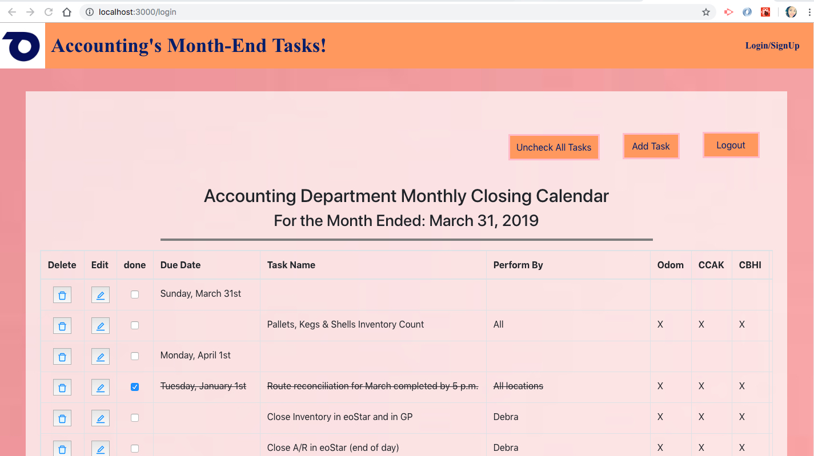

# Accounting's Month-End Calendar!
This is an App where Employees can access and check box the tasks they have done so that manager and other employees can see the month end task progress. Please Visit App [Here!](https://odom-tasks.herokuapp.com/)

## Motivation

I have been working as an accountant in several companies and I see the same issue in the accounting team in every company. The issue we have a lot of tasks during the month end closing time, and the tasks of one employee within the team relate to another. Sometimes they have to wait for others to complete the tasks before they can do their tasks. This app is created to help employees see the month end tasks progress and they don't have to send out multiple emails to ask others if the tasks have been completed. Moreover, manager can login to this app to track the progress of all tasks, and this make it easier for manager to monitor on employees's work. Finally, this app is also a good tracker to track all tasks and make sure all tasks are completed before the due dates and make sure employee don't miss any task. 

## Production Status

 Accounting's Month-End Calendar is still being debugged, but currently offers all basic features. 

## Screenshots

#### Home Page

#### Login and Sign Up page 

#### Task Page after Logged In

## Tech/Frameworks Used

+ MongoDB
+ ES6
+ Express
+ Node.js
+ React
+ Firebase
+ Calendar Picker
+ Bootstrap
+ Heroku

## GitHub best practices and guidance:
1.  Checkout the master branch using `git checkout master`
2.  Update your local repo with the latest changes using `git pull origin master`
3.  Create and checkout a new branch using `git checkout -b <your-branch-name>`
4.  Always include your initials in your branch name followed by the functionality/feature you're working one, example: `vm-userAuthentication`
5.  Run `git add -A`
6.  Run `git commit -m "descriptive message here"`
7.  Push these changes back up to GitHub using `git push origin \<your-branch-name\>`
8.  Navigate to your repository in GitHub and click the green button to `"create a pull request"`
9. Once code is reviewed by at least one reviewer `"merge pull request"`

This project was bootstrapped with [Create React App](https://github.com/facebook/create-react-app).

## Available Scripts

In the project directory, you can run:

### `npm start`

Runs the app in the development mode. 
Open [http://localhost:3000](http://localhost:3000) to view it in the browser.

The page will reload if you make edits. 
You will also see any lint errors in the console.

### `npm test`

Launches the test runner in the interactive watch mode. 
See the section about [running tests](https://facebook.github.io/create-react-app/docs/running-tests) for more information.

### `npm run build`

Builds the app for production to the `build` folder. 
It correctly bundles React in production mode and optimizes the build for the best performance.

The build is minified and the filenames include the hashes. 
Your app is ready to be deployed!

See the section about [deployment](https://facebook.github.io/create-react-app/docs/deployment) for more information.

### `npm run eject`

**Note: this is a one-way operation. Once you `eject`, you can’t go back!**

If you aren’t satisfied with the build tool and configuration choices, you can `eject` at any time. This command will remove the single build dependency from your project.

Instead, it will copy all the configuration files and the transitive dependencies (Webpack, Babel, ESLint, etc) right into your project so you have full control over them. All of the commands except `eject` will still work, but they will point to the copied scripts so you can tweak them. At this point you’re on your own.

You don’t have to ever use `eject`. The curated feature set is suitable for small and middle deployments, and you shouldn’t feel obligated to use this feature. However we understand that this tool wouldn’t be useful if you couldn’t customize it when you are ready for it.

## Learn More

You can learn more in the [Create React App documentation](https://facebook.github.io/create-react-app/docs/getting-started).

To learn React, check out the [React documentation](https://reactjs.org/).

### Code Splitting

This section has moved here: https://facebook.github.io/create-react-app/docs/code-splitting

### Analyzing the Bundle Size

This section has moved here: https://facebook.github.io/create-react-app/docs/analyzing-the-bundle-size

### Making a Progressive Web App

This section has moved here: https://facebook.github.io/create-react-app/docs/making-a-progressive-web-app

### Advanced Configuration

This section has moved here: https://facebook.github.io/create-react-app/docs/advanced-configuration

### Deployment

This section has moved here: https://facebook.github.io/create-react-app/docs/deployment

### `npm run build` fails to minify

This section has moved here: https://facebook.github.io/create-react-app/docs/troubleshooting#npm-run-build-fails-to-minify

